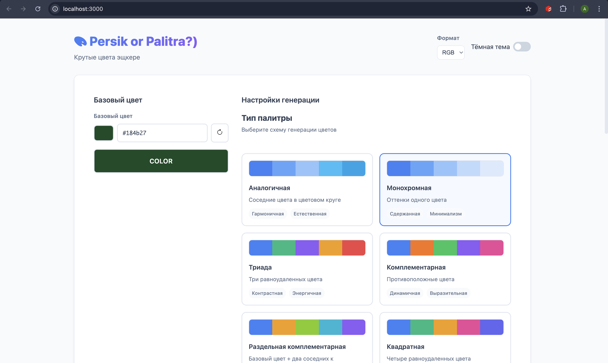
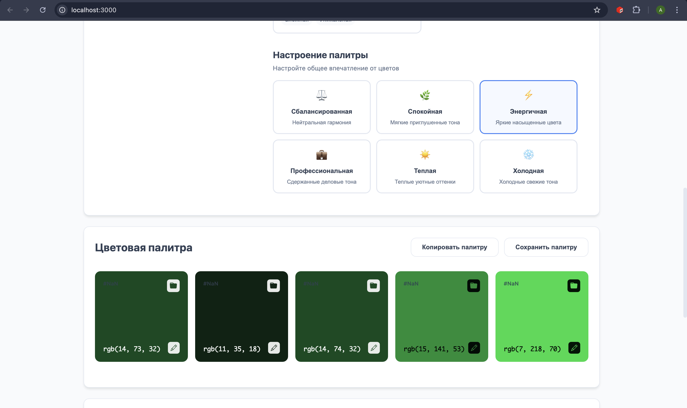
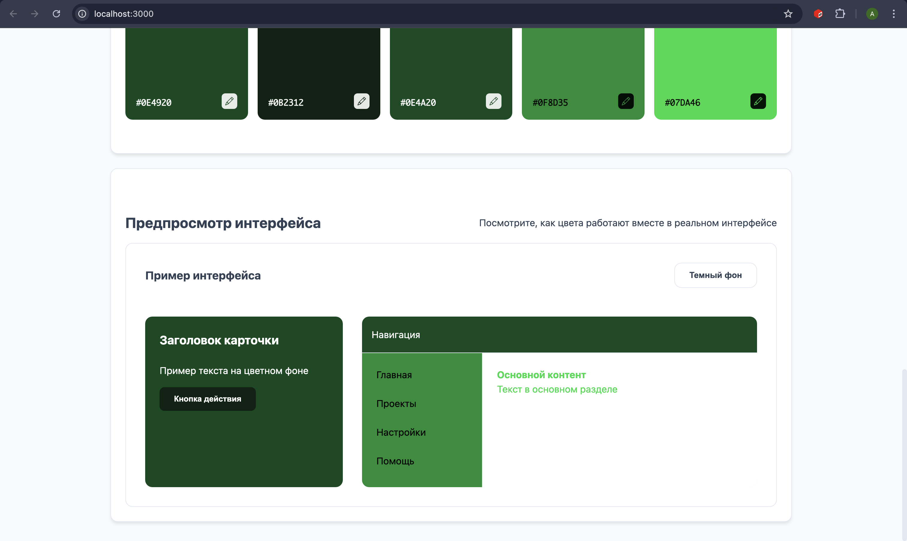
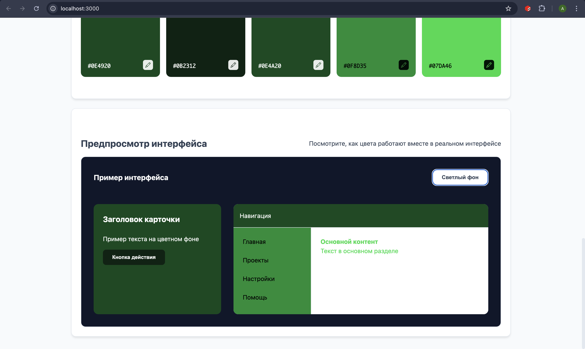

# Persik or Palitra?)

## Приложение для генерации необходимой палитры

Реализован широкий функционал выбора палитры и дальнейшего ее просмотра, а также применения в веб-разработке. 

## Генерация палитры
Выберите базовый цвет:
- Используйте цветовой пикер
- Введите HEX значение вручную
- Нажмите кнопку случайного цвета



Выберите тип палитры:
- Аналогичная: Соседние цвета в цветовом круге
- Монохромная: Оттенки одного цвета
- Триада: Три равноудаленных цвета
- Комплементарная: Противоположные цвета
- Раздельная комплементарная: Базовый + два соседних к противоположному
- Квадратная: Четыре равноудаленных цвета
- Составная: Комбинация различных схем

Настройте настроение:
- Сбалансированная: Нейтральная гармония
- Спокойная: Мягкие приглушенные тона
- Энергичная: Яркие насыщенные цвета
- Профессиональная: Сдержанные деловые тона
- Тёплая: Теплые уютные оттенки
- Холодная: Холодные свежие тона



Управление цветами:
- Возможность копирования цвета в буфер обмена
- Возможность закрепить/открепить цвет
- При генерации новой палитры: Закрепленные цвета сохраняются

Предпросмотр интерфейса веб-приложения:
- Переключение между светлым и тёмным фоном
- Просмотр цветов в реальных UI компонентах
- Тестирование контрастности и читаемости






## Установка и запуск
```bash
git clone https://github.com/soalko/FBD_KR5_Soldatov.git
cd FBD_KR5_Soldatov
npm install
npm start
```